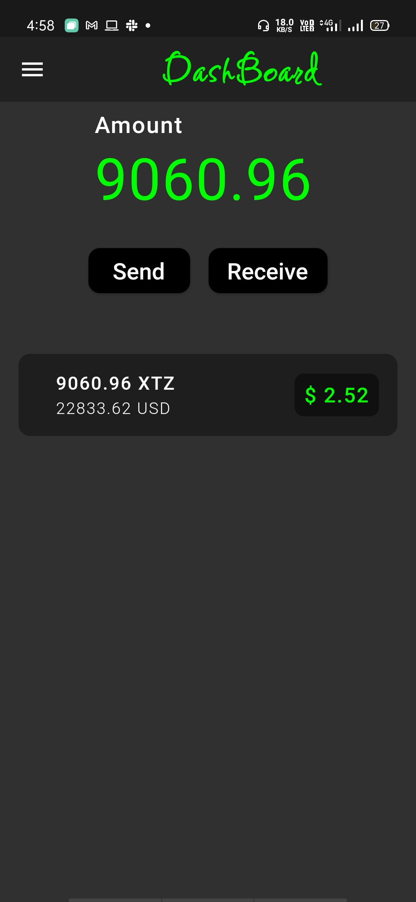
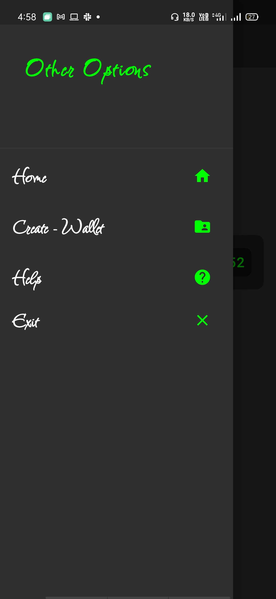
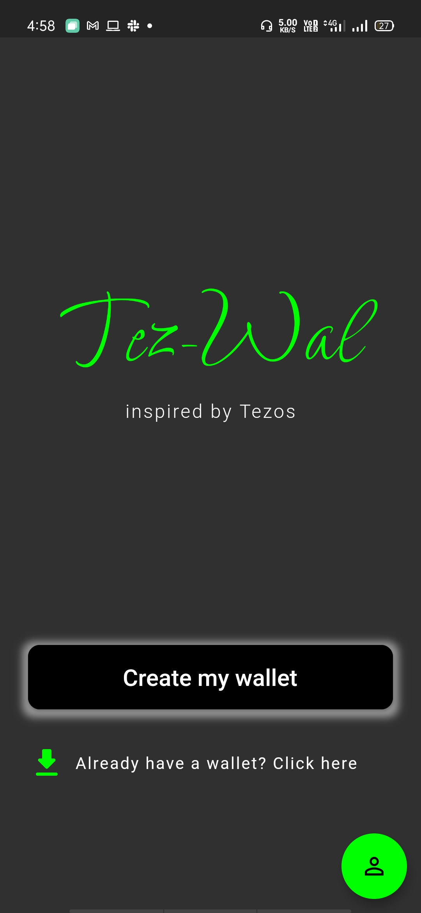
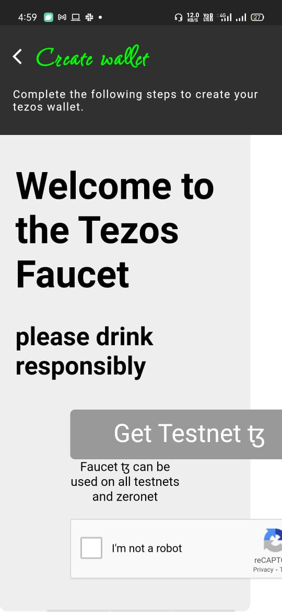
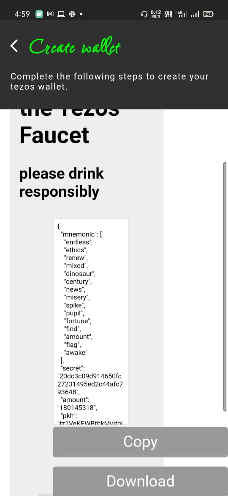
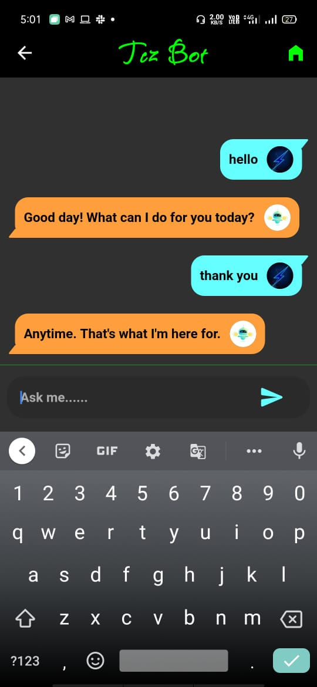
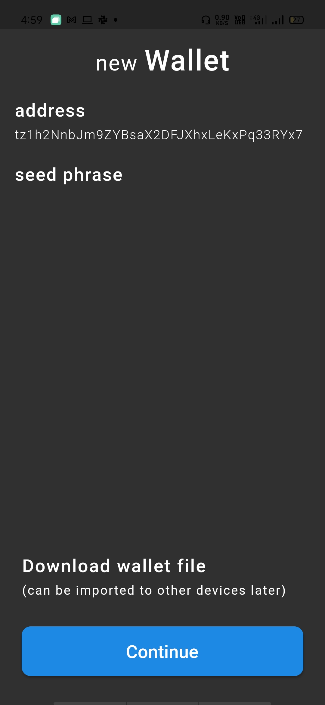

# Tezwal ✨

Tezwal is a crypto wallet for tezos xtz using tezos as the block chain technology in the backend. 🎈

## Getting Started
Tezwal is a flutter based Tezos Wallet that uses Hive and tezter_dart and helps in storing and sending/receiving funds with ease.It is secure as it is built totally on Tezos platform.

It is a easy way to check your transaction history/current values and also send/recieve transactions between different addresses by simply generating a QR code which could be then scanned and the the transaction is complete.

🔥We have used Hive as aur backend to create blocks of data and and its fast and secure,used tezter_dart dart for tezos implementation.We have also implemented a chatbot with dialogflow using google cloud platform for help in case someone needs more information or help about any topic.🔥

The following plugins are used in our project :
#### 📕Flutter_inappwebview
#### 🎆Permission_handler
#### 🎍Flutter_downloader
#### 🎊Path_provider
#### 🧧Shared_preferences
#### 🎁Hive
#### 🧨Hive_flutter
#### 🎉Qr_flutter
#### 📗Tezster_dart

**Others :** 

#### 🌊Dialogflow
#### 🌌Google Cloud services

## How to run :

You should have **Flutter (v1.22.6)** installed and properly set up on your system. Connect a physical device before running the app.

> Currently tested on Android device

1. Clone the repo:
  
  ```sh
  git clone https://github.com/amitpola/TezWal.git
  ```

2. Navigate to the directory:

  ```sh
  cd tezwal
  ```
 
3. Get Flutter packages:

  ```sh
  flutter pub get
  ```

4. Run the app in terminal :

  ```sh
  flutter run --no-sound-null-safety
  ```

## Routings :
`home -> hompage of the  app` <br>
`create-wallet-> cretaet wallet page`<br>
`help-> chatbot`<br>
`exit-> quits app`<br>

# Screenshots :

<p align="center">
  
  
  
  
</p>

<p align="center">
  
  
  
  
</p>
